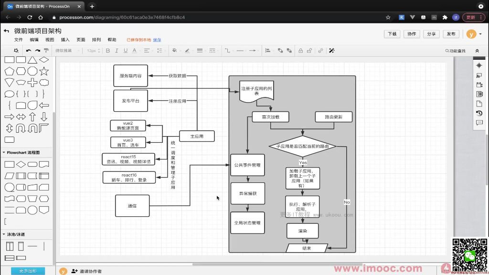

# 绘制项目框架图

## 微前端项目技术选型
* 主应用使用vue3框架实现
* 分为四个模块：vue3、vue2、react15 和 react16
* 服务端内容通过koa搭建接口
* 发布平台使用express

## 主应用功能
* 注册子应用
* 加载、渲染子应用
* 路由匹配（activeWhen， rules - 由框架判断）
* 获取数据（公共依赖、通过数据做鉴权处理）
* 通信（父子通信、子父通信）

## 子应用功能
* 渲染
* 监听通信（主应用传递过来的数据）

## 微前端框架的功能
* 子应用的注册
* 有开始内容（应用加载完成，）
* 路由更新潘丹
* 匹配子应用的内容
* 完成所有依赖项的执行
* 将子应用渲染在固定的容器内
* 公共时间额管理
* 一擦会给你的捕获和报错
* 全局的状态管理的内容
* 沙箱的隔离
* 通信机制

## 服务端的功能
* 提供数据服务

## 发布平台
* 主子应用的打包、发布

